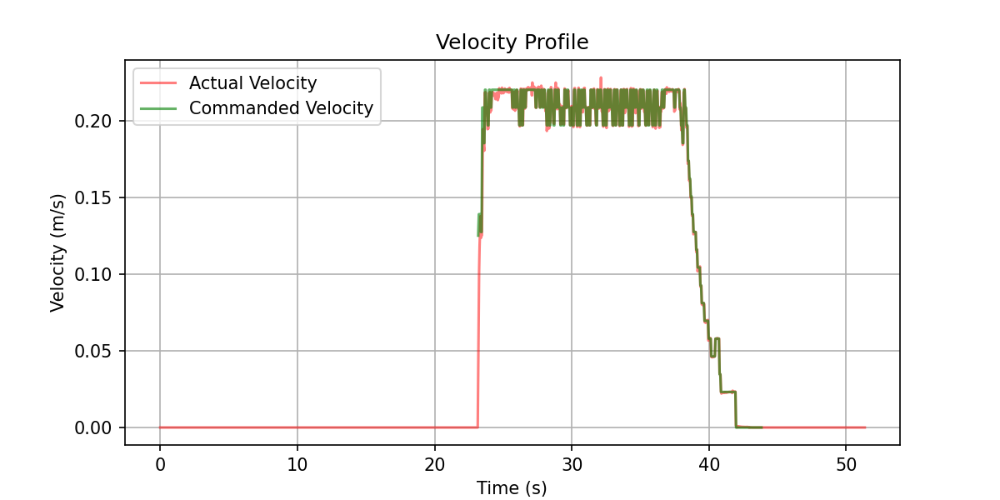
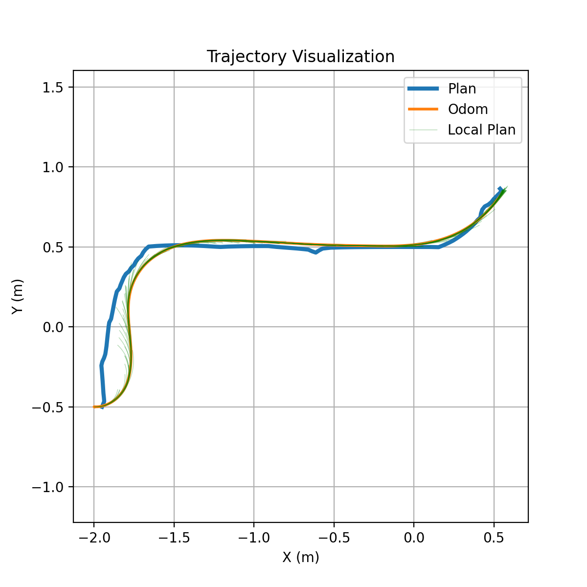
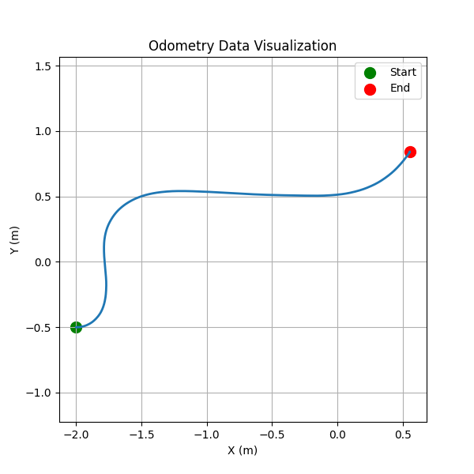
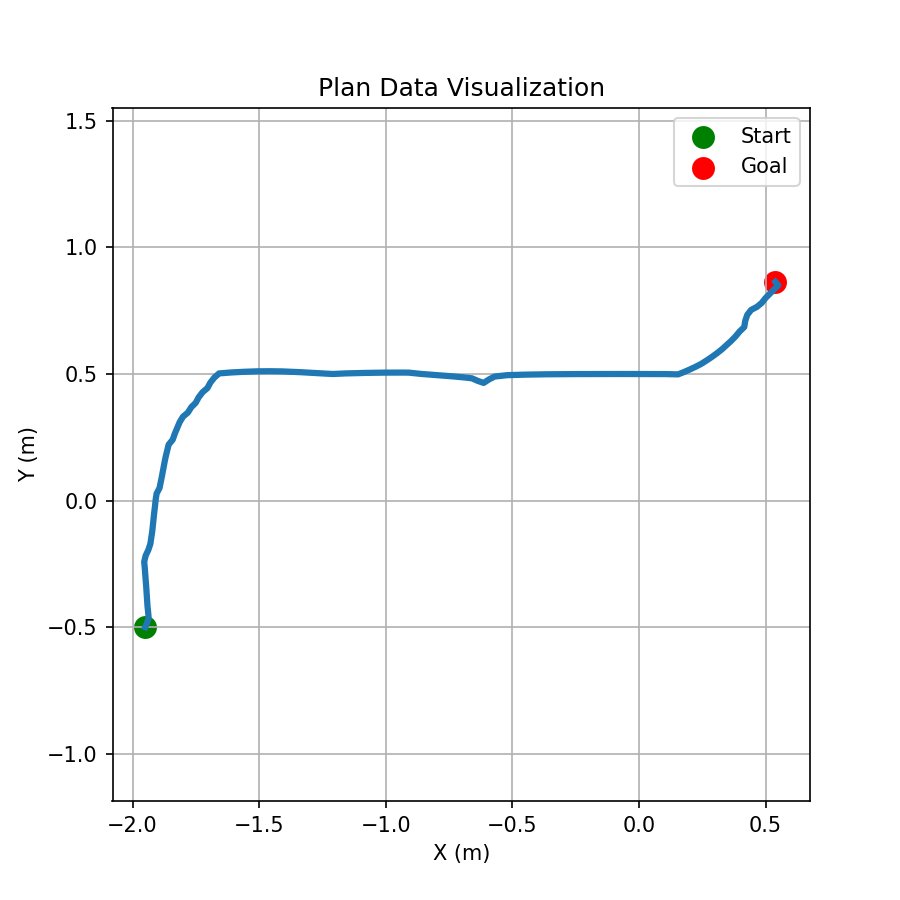
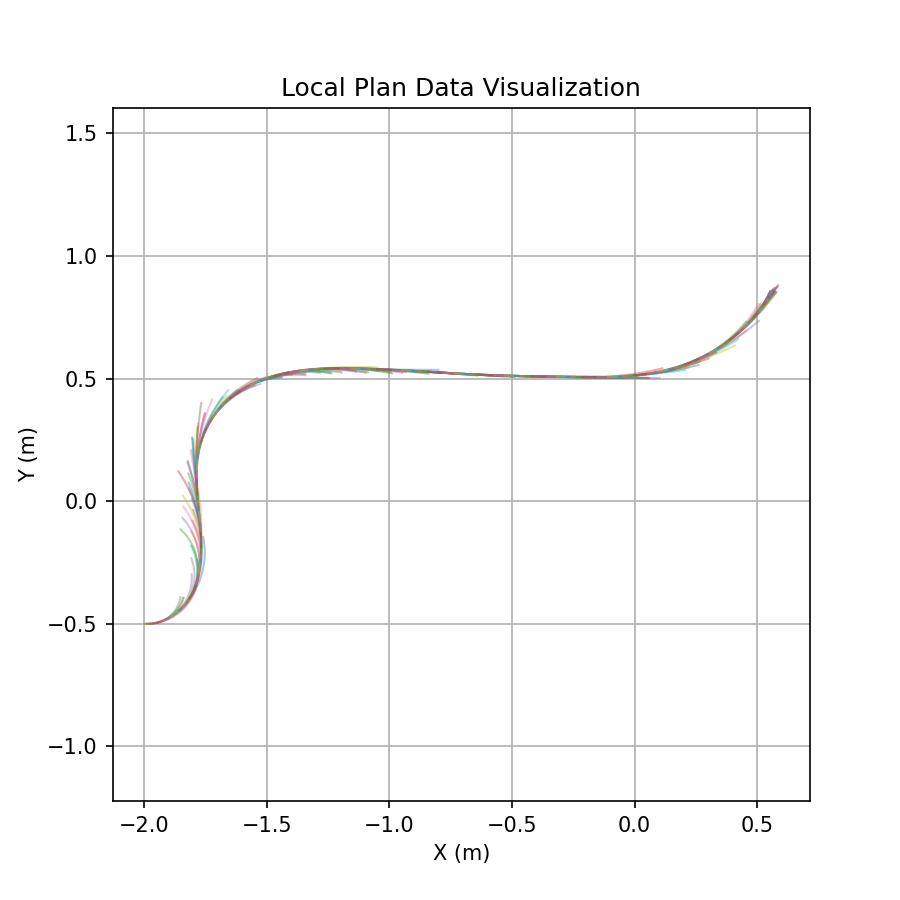

# Astryin - ROS2 Navigation Behavior Analysis Toolkit

**Astryin** is a tool designed to help developers analyze and visualize the behavior of ROS2 navigation systems using recorded bag files. This toolkit focuses on understanding subtle behavioral changes in navigation tasks, which are often difficult to capture through traditional debugging methods.

## Problem We Are Solving

One of the biggest challenges in ROS2 navigation is understanding and analyzing the behavior of a robot's navagation over time, especially after parameter tuning or system changes. Common issues developers face include:
- **Oscillations and zig-zags** in robot movement.
- Behavior differences between **simulation and real-world performance**.
- **Unpredictable failures** when tuning parameters.
- Difficulty in comparing different runs of navigation and pinpointing what changed between them.

Astryin aims to solve these problems by providing an easy-to-use framework to analyze and visualize key navigation metrics like velocity profiles, tracking errors, and trajectory analysis from bag files. This enables developers to quickly understand what's happening under the hood of their robots and improve their system performance in a more informed way.

## Installation
Clone the repository and install in editable mode:

```bash
git clone https://github.com/kehan-zhou/astryin.git
cd astryin
pip install -e
```

## Examples
Here are some examples of how to use Astryin with recorded ROS2 bag files.

### Example 1: Analyze a ROS2 bag file
Run the following command to analyze a bag.

```bash
astryin analyze examples/turtlebot3_navigation
```
Output:

```bash
[INFO] [1773133167.318602742] [rosbag2_storage]: Opened database 'examples/turtlebot3_navigation/turtlebot3_navigation_0.db3' for READ_ONLY.

Bag Summary
-------------------------------
Bag duration:          51.39 s
Odom samples:          1511
Plan samples:          138

Motion Window
-------------------------------
Motion start:          23.18 s
Motion end:            41.93 s
Motion duration:       18.75 s
Motion odom samples:   552

Trajectory Metrics
-------------------------------
Path length:           3.43 m
Mean velocity:         0.18 m/s
Max velocity:          0.23 m/s
Mean tracking error:   0.045 m
Max tracking error:    0.178 m
```

### Example 2: Visualize velocity profile
Use the following command to compare the robot's odometry velocity with the commanded velocity:

```bash
astryin plot velocity examples/turtlebot3_navigation
```

Output:

```bash
[INFO] [1773133209.823054913] [rosbag2_storage]: Opened database 'examples/turtlebot3_navigation/turtlebot3_navigation_0.db3' for READ_ONLY.
Velocity profile plot saved to outputs/velocity_profile.png
```



### Example 3: Visualize the trajectory
Use the following command to visualize the robot's trajectory, including odometry, global plan, and local plan:

```bash
astryin plot trajectory examples/turtlebot3_navigation
```

Output:

```bash
[INFO] [1773190749.119507577] [rosbag2_storage]: Opened database 'examples/turtlebot3_navigation/turtlebot3_navigation_0.db3' for READ_ONLY.
odom (/odom): loaded
plan (/plan): loaded
local_plan (/local_plan): loaded
Trajectory plot saved to outputs/trajectory.png
```


### Example 4: Visualize odometry data
Use the following command to visualize the robot's odometry data:

```bash
astryin plot odom examples/turtlebot3_navigation
```

Output:

```bash
[INFO] [1773191090.655977896] [rosbag2_storage]: Opened database 'examples/turtlebot3_navigation/turtlebot3_navigation_0.db3' for READ_ONLY.
Odometry plot saved to outputs/odom.png
```


### Example 5: Visualize global plan
Use the following command to visualize the robot's global plan data:

```bash
astryin plot plan examples/turtlebot3_navigation
```

Output:

```bash
[INFO] [1773191962.643313462] [rosbag2_storage]: Opened database 'examples/turtlebot3_navigation/turtlebot3_navigation_0.db3' for READ_ONLY.
Plan plot saved to outputs/plan.png
```


### Example 6: Visualize local plan
Use the following command to visualize the robot's local plan data:

```bash
astryin plot local_plan examples/turtlebot3_navigation
```

Output:

```bash
[INFO] [1773191284.541984597] [rosbag2_storage]: Opened database 'examples/turtlebot3_navigation/turtlebot3_navigation_0.db3' for READ_ONLY.
Local plan plot saved to outputs/local_plan.png
```
